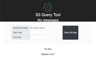
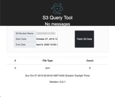

# S3 Bucket Analyzer

 

### Description:

A very simple GUI using Electron and React that displays data related to the bucket.
The main (eletron.js), it uses your local AWS credentials to make the API calls.
Then it uses Electrons IPC communications to push this data to the frontend (needed since front end can't speak to local files)


---


An example of using create-react-app and Electron.

## Scripts
```yarn start``` will start the Electron app and the React app at the same time.  
```yarn build``` will build the React app and package it along the Electron app.

## Read more
Base electron code written by [@thekitze](https://twitter.com/thekitze)  
Article used [my Medium article](https://medium.com/@kitze/%EF%B8%8F-from-react-to-an-electron-app-ready-for-production-a0468ecb1da3).
